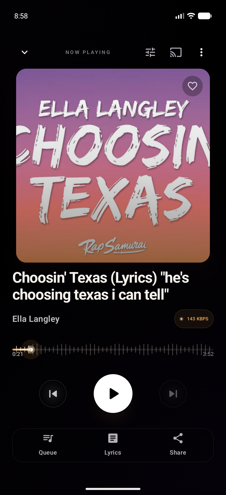
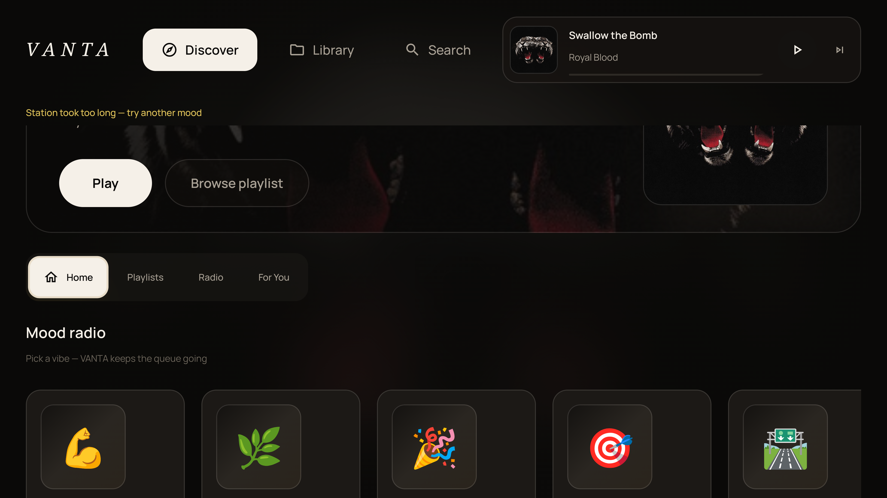
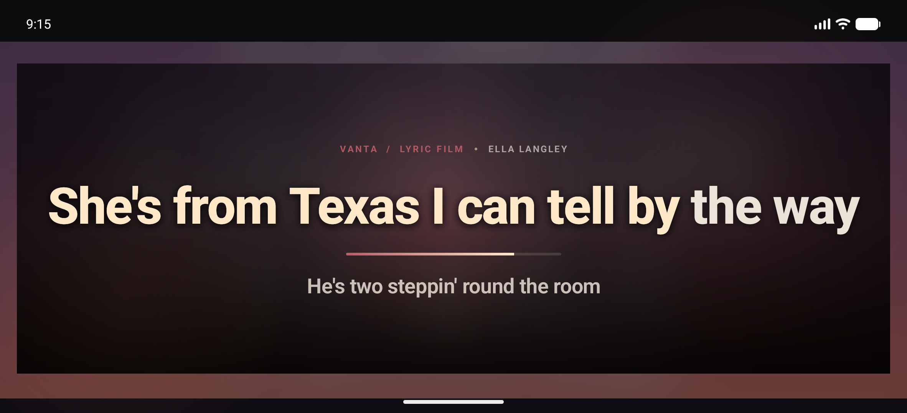
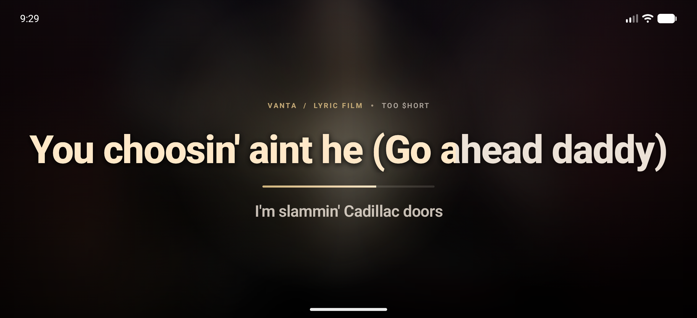

<div align="center">


# 🎶 Encore Player
### The open-source Spotify alternative — built for audiophiles, free for everyone.

[](#-install)
[](#-acoustic-architecture)
[](#-acoustic-architecture)
[](#-1-click-spotify-library-sync)
[](./LICENSE)
[](#-roadmap)

<br/>

<p align="center">
  <b>Encore</b> is a handcrafted, community-built music player engineered for audiophiles who demand true uncompressed acoustic fidelity — and who believe music software should be free, open source, and respect your privacy. Featuring a proprietary binaural <b>7.1.4 Dolby Atmos spatial engine</b>, bit-perfect <b>32-bit/192 kHz lossless playback</b>, and <b>1-Click Spotify Library Sync</b>, Encore turns any standard pair of headphones or speakers into an acoustically calibrated private soundstage.
</p>

<p align="center">
  <b>No ads. No trackers. No subscription. No bullshit.</b>
</p>

[📥 Install](#-install) • [💎 Acoustic Architecture](#-acoustic-architecture) • [📸 Device Showcase](#-multi-device-showcase) • [🛡️ Privacy & Security](#-security--privacy-guarantee) • [🤝 Contributing](#-contributing) • [🗺️ Roadmap](#-roadmap)

---

</div>

## 🎯 Why Encore?

Spotify dominates streaming, but its closed ecosystem locks you into its app, its ads, its audio quality ceilings, and its surveillance. **Encore** is the open answer:

* **Open source (GPL-3.0).** Every line of audio engine code, every network call, every DSP filter is auditable. Build it yourself. Fork it. Improve it.
* **Android-first, Android-only (for now).** One platform, polished deeply — no fragmented quality across iOS/desktop/Web.
* **Spotify as a data source, not a destination.** Bring your Spotify library in with one click, then play it back at full lossless quality from the sources you actually trust (Qobuz, Tidal, Deezer, Apple Music, Amazon Music, your own local files).
* **True audiophile fidelity.** 32-bit / 192 kHz bit-perfect signal path. 7.1.4 binaural HRTF spatial rendering. 5,000+ AutoEQ headphone profiles. Studio-grade 15-band parametric EQ.
* **Zero ads. Zero telemetry. Zero trackers.** Verified, not promised.

---

## 💎 Acoustic Architecture

### 🎧 Custom 7.1.4 Binaural HRTF Spatial Audio Engine
* **Physical 7.1.4 Speaker Simulation**: Decodes multi-channel spatial audio into physical 3D acoustic coordinates (CICP 19 standard: Left, Right, Center, LFE Subwoofer, Side Surrounds, Rear Surrounds, and 4 Overhead Height channels).
* **Valve Steam Audio Acoustic Pipeline**: Leverages high-resolution Head-Related Transfer Functions (HRTF) to recreate natural room acoustics and depth perception in standard stereo headphones.
* **Analog Limiter & High-Frequency Air**: Custom analog-modeled saturation limiter, subwoofer warmth enhancement, and a +2.2 dB air presence filter eliminate the quiet, veiled sound typical of standard software virtualizers.

### 💎 Bit-Perfect 32-Bit Lossless Signal Path
* Direct hardware audio pipeline bypassing Android's default 48 kHz mixer resampling.
* Native decoding for 24-bit/192 kHz FLAC, ALAC, WAV, and immersive multichannel containers.
* Comprehensive audio inspector built directly into the Now Playing menu for real-time container, codec, sample rate, bit depth, and bitrate verification.

### 🟢 1-Click Spotify Library Sync
* Connect your Spotify account with **1 tap** using secure RFC 7636 PKCE authorization.
* Zero token pasting or API setup required — automatically imports your **Liked Songs** and **Personal Playlists** directly into Encore.
* Automatic silent token refresh protected by Android Keystore hardware encryption.
* Encore treats Spotify purely as a *catalog reference*; playback streams from higher-fidelity sources when available.

### 🎛️ Studio-Grade DSP & Parametric EQ Suite
* **15-Band Parametric Equalizer**: Surgical frequency shaping with variable Q factors and gain compensation.
* **5,000+ AutoEQ Profiles**: Instant one-tap target compensation curves for thousands of popular over-ear, on-ear, and IEM headphones.
* **Warm Tube Saturation & Dynamic Limiter**: Gentle analog harmonic drive without digital harshness or clipping.

### 🎚️ Format-Aware Intelligent Sound Check
* Automatically levels perceived loudness between quiet multichannel Atmos recordings and aggressively compressed stereo masters for smooth, continuous listening.

---

## 📸 Multi-Device Showcase

### 📱 Flagship Mobile Luxury Experience
> Deep AMOLED Obsidian aesthetics, animated artwork motion canvas, dynamic synchronized lyrics, and real-time audio waveform scrubbing.

<p align="center">
  
  &nbsp;&nbsp;&nbsp;&nbsp;
  
</p>

---

### 📺 Android TV & 10-Foot Living Room Theater
> Tailored for D-pad remote navigation on Google TV, Fire TV, and Nvidia Shield with ambient reactive backdrops and living-room jukebox staging.

<p align="center">
  
  &nbsp;
  
</p>

---

### 🚐 RV, Cockpit & Landscape Panoramic Mode
> High-contrast oversized touch targets, full-width time alignment, and cinematic line-by-line synced lyrics engineered for automotive and dashboard mounts.

<p align="center">
  
  &nbsp;
  
</p>

---

## 📥 Install

### Option A — Pre-built APK (recommended for non-developers)

Download the latest signed release directly from the [GitHub Releases page](../../releases/latest).

1. Tap the download link above to get `encore.apk`.
2. Open the downloaded file on your Android device (Android 8.0 Oreo or newer).
3. If prompted by your browser, tap **Allow from this source**.
4. Launch **Encore** and experience your music in pure spatial clarity.

### Option B — Build from source

```bash
git clone https://github.com/encore-player/EncorePlayer.git
cd EncorePlayer

# (optional) supply your own signing keystore for release builds
export ENCORE_RELEASE_STORE_FILE=$HOME/.android/encore-release.jks
export ENCORE_RELEASE_STORE_PASSWORD=********
export ENCORE_RELEASE_KEY_ALIAS=encore
export ENCORE_RELEASE_KEY_PASSWORD=********

# Debug build (no signing config required)
./gradlew :app:assembleDebug
# -> app/build/outputs/apk/debug/encore.apk

# Release build (requires signing env vars above)
./gradlew :app:assembleRelease
# -> app/build/outputs/apk/release/encore.apk
```

> Building Encore requires **JDK 17+, Android SDK 36, Android NDK 28.2.13676358, and CMake 3.22.1**.
> The Gradle wrapper downloads the correct Gradle version automatically.

---

## 🛡️ Security & Privacy Guarantee

Encore is strictly non-commercial, privacy-respecting software built by music lovers for music lovers:

* **Zero Advertisements**: No banner ads, popup interruptions, or commercial breaks.
* **Zero Telemetry or Trackers**: No third-party analytics, behavioral tracking, or data profiling.
* **No Firebase / No Analytics**: The Firebase Auth dependency is included for optional cloud sync, but **no `google-services.json` ships in this repo**. The app builds and runs fully offline without it.
* **Auditable Source Code**: Every network call, every DSP filter, every storage write is right here in this repository. Read it. Build it yourself. Verify.
* **Open Source under GPL-3.0**: Derivative works must remain open. No closed-source forks.

---

## 🤝 Contributing

Encore welcomes contributors. Whether you want to fix a bug, improve the DSP pipeline, add a new audio source connector, or just clean up the UI — pull requests are welcome.

### Areas that need help right now
* **Audio source connectors** — Tidal, Qobuz, Apple Music, Amazon Music, Deezer, SoundCloud, YouTube Music. Each has rough edges.
* **Lyrics providers** — LRCLib, Musixmatch, NetEase. More sources = better coverage.
* **Android TV UX** — The jukebox stage is beautiful but D-pad navigation needs polish.
* **Performance** — Native DSP is fast; Compose UI can lag on mid-tier devices.
* **Translation** — Currently English-only; we'd love i18n contributors.
* **Documentation** — DSP concepts, source connector architecture, spatial audio primer.

### Quick start for contributors

```bash
git clone https://github.com/encore-player/EncorePlayer.git
cd EncorePlayer
./gradlew :app:assembleDebug     # verify it builds
# Make your changes...
./gradlew :app:test              # run unit tests
```

Open a PR against `main` with a clear description of what changed and why. For DSP or audio-path changes, include before/after measurements if possible.

---

## 🗺️ Roadmap

### ✅ Now (v2.0 — current)
* Android phone + Android TV from a single APK
* 7.1.4 HRTF spatial audio engine
* Bit-perfect 32-bit/192 kHz lossless playback
* Spotify 1-click library sync
* 15-band parametric EQ + 5,000+ AutoEQ profiles
* Local file playback + cloud library connectors

### 🚧 Soon
* Native Material 3 Expressive redesign
* Improved Android Auto / Wear OS experience
* Friend activity (currently local-only)
* Plugin API for third-party DSP modules

### 🔭 Later (community-driven)
* iOS port (currently exists but unmaintained — see `ios/`)
* Desktop player (currently exists but unmaintained — see `desktopApp/`)
* Self-hostable station backend (see `station-backend/` and `vps-backend/`)
* Cross-device library sync without Firebase

> **Android-only for now.** iOS and desktop code exists in-tree as historical reference, but is not actively maintained. If you want to lead one of those ports, open an issue and let's talk.

---

## 💬 Community

* **Bug Reports & Feature Requests**: [GitHub Issues](../../issues)
* **Discussions**: [GitHub Discussions](../../discussions)
* **Source**: This repository is the single source of truth.

Encore is community-funded and volunteer-built. There is no Ko-fi, no Patreon, no premium tier — if you find the project useful, contribute code, file good bug reports, or tell a friend.

---

## 📄 License

Encore Player is licensed under the **GNU General Public License v3.0**. See [`LICENSE`](./LICENSE) for the full text.

Third-party components retain their original licenses (MIT, BSD, Apache 2.0, Fraunhofer MPEG-H, Ittiam, Steam Audio, OpenJOC, Eclipsa, JamesDSP, libiamf). See `app/src/main/assets/licenses/` for those texts.

This project is a rebrand and continuation of the original [VantaMusic](https://github.com/drewk312/VantaMusic) by [@drewk312](https://github.com/drewk312). All credit for the audio engine, DSP pipeline, and original product goes to the original author. Encore exists to keep that work free and open.

---

<div align="center">
  <sub>Encore Player — Open source. Open ears. Built for everyone.</sub>
</div>
